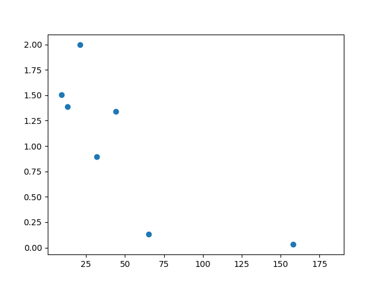
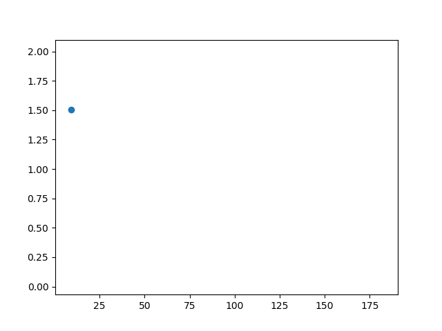
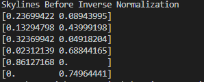
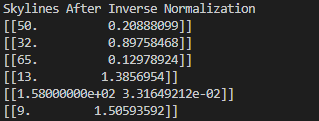

# Shooting Stars in the Sky: An Online Algorithm for Skyline Queries

Created By: 상민 이
Last Edited: Feb 03, 2020 8:09 PM

# Introduction

This Skyline Query is a code I **programmed myself** which was first introduced by **pseudo code** in **Shooting Stars in the Sky: An Online Algorithm for Skyline Queries** (skyline_query.py)

skyline_query_sort.py is an algorithm I thought would improve skyline query speed compared to algorithm introduced in **Shooting Stars in the Sky: An Online Algorithm for Skyline Queries** but actually is slow because it uses sort.
in 1000000 random data, it takes 4.3 to sort and 0.5 to get skylines while it takes 0.9secs with  **Shooting Stars in the Sky: An Online Algorithm for Skyline Queries** algorithm

- Shooting Stars in the Sky: An Online Algorithm for Skyline Queries (2002 Donald Kossmann)
- Python

# Original Data (30 elements)

# Data after ignoring Region3

# Data from Region1

# Data from Region2

# Result Skyline

# References

[Shooting Stars in the Sky: An Online Algorithm for Skyline Queries](https://www.sciencedirect.com/science/article/pii/B9781558608696500329)